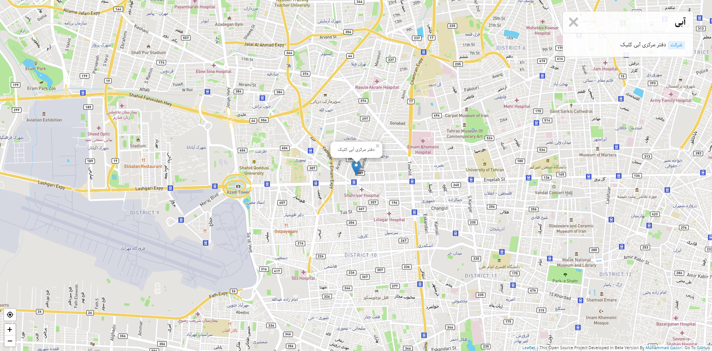
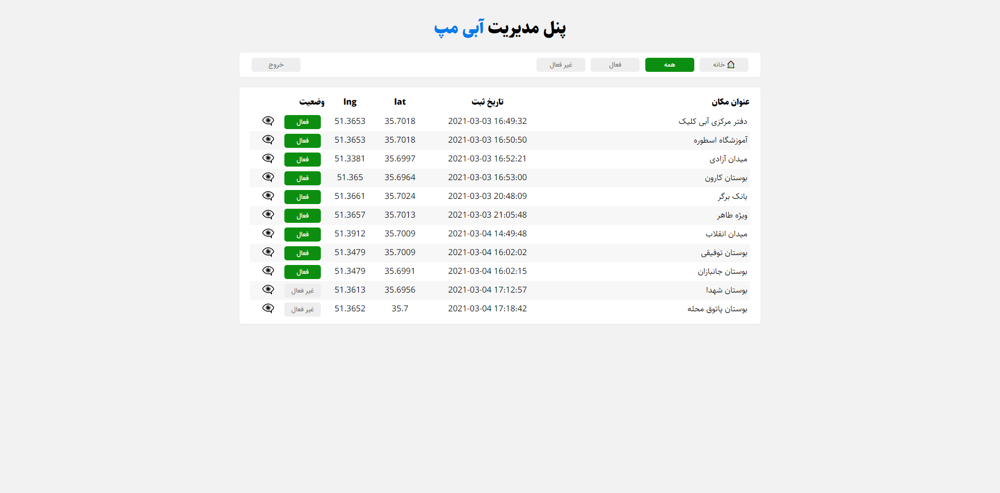

  
  <h3 align="center">abi map</h3>
  <h5 align="center">version 1.0.0-beta (March 06 2021)</h5>
  

    The map that you need!
     
    <a href="https://abimap.ir">View In WebSite</a>
    |
    <a href="https://github.com/mgazori/abimap/issues">Report Bug</a>
    |
     <a href="https://github.com/mgazori/abimap/issues">Request Feature</a>
  

<h2>Table of Contents</h2>

- [About abi map](#about-abi-map)
- [Built with](#built-with)
- [Setup training](#setup-training)
- [Features](#features)
- [Screenshot](#screenshot)
- [Important things](#important-things)
- [Bugs in the project](#bugs-in-the-project)
- [Contact with me](#contact-with-me)
- [License](#license)

## About abi map
This project is licensed under the terms of the **MIT license** and developed by **Mohammad Gazori**.  
This project in beta version and has also been developed procedurally.  
You can use the project for yourself as well as give feedback or request features that you would like to be added to the project.  
be successful and victorious.

## Built with
- PHP 8
- HTML 5
- CSS 3
- JavaScript
- JQuery 3.5.1
- Ajax
- Leaflet 1.7.1
- SweetAlert 2
- MariaDB 10.4.17 (You can use MySQL and...)
- DB-Connection (PDO)

## Setup training
 1. Create a database of your choice and import the tables from the Tables.sql file at the root of the project.
 2. Enter the bootstrap folder and set your database information in the config.php file.
 3. Enter the bootstrap folder and set your information in the constants.php file.
 4. Enter your username and password (remember your password should be in BCRYPT method) in the config.php file to siteAdmin array.

## Features
- login admins
- Admin panel (root/adm.php)
- Confirm registered locations by admin
- Keep admin login by session
- BCRYPT method to store admin password
- Admin logout
- high security
- Prevent sql injection
- Utf8mb4 character
- Use Ajax
- Register location by anyone
- Search verified location
- Categories location
- Use geolocation
- Display user location
- Display all location information in admin panel
- Display location by iframe in admin panel
- Filter Location by status
- Change location status
- High speed
- Responsive

## Screenshot

<a href="https://github.com/mgazori/abimap">
<h2>map</h2>

<h2>admin panel</h2>

</a>

## Important things
 1. You can access admin panel in yourdomain.com/adm.php
 2. Admin panel can be used on mobiles and tablets but has not yet been optimized for these devices.
 3. You can use our service at [abimap.ir](https://abimap.ir/) without launching this program.
 4. Your pull requests are all reviewed and accepted if possible.

## Bugs in the project
My good friend, if you find a bug in the project, you can let me and other friends know via GitHub. [https://github.com/mgazori/abimap/issues](https://github.com/mgazori/abimap/issues)

## Contact with me
 - Get in touch with me through my personal website. [mgazori.com](https://mgazori.com)
 - By Email [info@mgazori.com](mailto:info@mgazori.com)

## License
You can check out the full license [here](https://github.com/MGazori/abimap/blob/master/LICENSE)  
This project is licensed under the terms of the MIT license. © [Mohammad Gazori](https://github.com/mgazori)